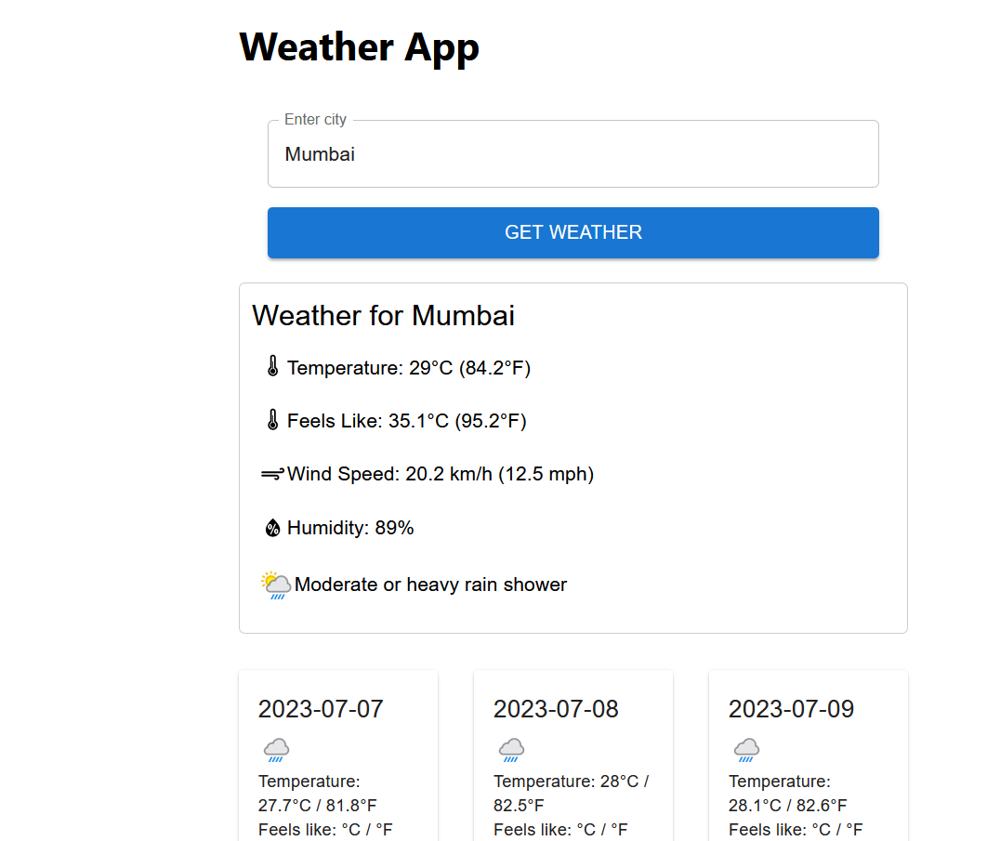

# Weather App

## About the Project

The Weather App is a web application that allows users to get the current weather information for a given city. It utilizes the OpenWeatherMap API to fetch the weather data based on the city input. The app provides temperature, feels like temperature, wind speed, humidity, and weather condition for the specified city.



## Setup

To set up and run the Weather App locally, follow these steps:

1. Clone the repository:

```
git clone https://github.com/arunaabh95/rise-and-shine-frontend.git
```


2. Navigate to the project directory:

```
cd rise-and-shine-frontend
```


3. Install the dependencies:

```
npm install
```

5. Build the project:

```
npm run build
```

6. Run the Docker script to create a Docker image:
```
docker build -t app .
```

7. Run the Docker container:

```
docker run -p 8080:80 app
```

8. Access the Weather App in your browser:

```
http://localhost:8080
```

## Project Structure

The project structure is organized as follows:

- `src/`: Contains the source code files for the React app.
- `public/`: Contains the public assets and the HTML template file.
- `Dockerfile`: Configures the Docker image for running the app.
